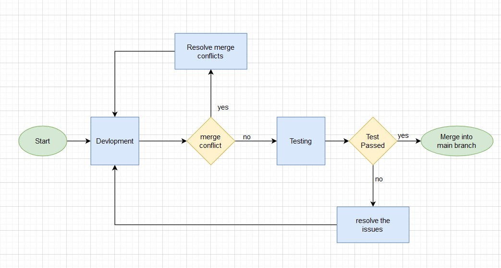

# Handling Code Review Feedback:

```ts
const handlesubmit = async (e) => {
  e.preventDefault();

  try {
    const res = await fetch(`${API_ENDPOINT}/organisations`, {
      method: 'POST',
      headers: { 'Content-Type': 'application/json' },
      body: JSON.stringify({ name: organisationName, user_name: userName, email: userEmail, password: userPassword }),
    });

    if (!res.ok) {
      throw new Error(`Sign-up failed with status ${res.status}`);
    }
    console.log('Sign-up successful');

    let { token, user } = await res.json();
    localStorage.setItem('authToken', token);
    localStorage.setItem('userData', JSON.stringify(user));
    navigate("/dashboard");
  } catch (err) {
    console.error('Sign-up failed:', err);
  }
};
```

# Code Review:

```ts
// Useing camelCase for naming variables
const handleSubmit = async (event: React.FormEvent<HTMLFormElement>) => {
  event.preventDefault();

  try {
    // Assign the object to a variable
    const obj = { name: organisationName, user_name: userName, email: userEmail, password: userPassword };

    // change the variable name to response for better understanding.
    const response = await fetch(`${API_ENDPOINT}/organisations`, {
      method: 'POST',
      headers: { 'Content-Type': 'application/json' },
      body: JSON.stringify(payload),
    });

    if (!response.ok) {
      throw new Error(`Sign-up failed with status ${response.status}`);
    }

    console.log('Sign-up successful');

    // Use const for variable names.
    const {token, user} = await response.json();

    localStorage.setItem(authTokenKey, token);
    localStorage.setItem(userDataKey, JSON.stringify(user));

    navigate("/dashboard");
    // change the variable name to error for better understanding.
  } catch (error) {
    console.error('Sign-up failed:', error);
  }
};
```

# Iterative Development Process:




# Resolving Merge Conflicts:

Merge conflicts occur when competing changes are made to the same line of a file, or when one person edits a file and another person deletes the same file.

## Code in 1 branch:

```ts
const handleSubmit = async (event: React.FormEvent<HTMLFormElement>) => {
  event.preventDefault();

  try {
    const obj = { name: organisationName, user_name: userName, email: userEmail, password: userPassword };

    const response = await fetch(`${API_ENDPOINT}/organisations`, {
      method: 'POST',
      headers: { 'Content-Type': 'application/json' },
      body: JSON.stringify(obj),
    });

    if (!response.ok) {
      throw new Error(`Sign-up failed with status ${response.status}`);
    }

    console.log('Sign-up successful');

    const {token, user} = await response.json();

    localStorage.setItem(authTokenKey, token);
    localStorage.setItem(userDataKey, JSON.stringify(user));

    navigate("/dashboard");
  } catch (error) {
    console.error('Sign-up failed:', error);
  }
};
```
## Code in 2 branch:

```ts
const handleSubmit = async (event: React.FormEvent<HTMLFormElement>) => {
  event.preventDefault();

  try {
    const obj = { name: organisationName, user_name: userName, email: userEmail, password: userPassword };

    const response = await fetch(`${API_ENDPOINT}/organisations`, {
      method: 'POST',
      headers: { 'Content-Type': 'application/json' },
      body: JSON.stringify(obj),
    });

    if (res.status === 400) {
      throw new Error("Sign-up failed");
    }

    console.log('Sign-up successful');

    const {token, user} = await response.json();

    localStorage.setItem(authTokenKey, token);
    localStorage.setItem(userDataKey, JSON.stringify(user));

    navigate("/dashboard");
  } catch (error) {
    console.error('Sign-up failed:', error);
  }
};
```
When branch 1 and branch 2 are merged, the following conflict occurs in the branch:

```ts 
const handleSubmit = async (event: React.FormEvent<HTMLFormElement>) => {
  event.preventDefault();

  try {
    const payload = { name: organisationName, user_name: userName, email: userEmail, password: userPassword };

    const response = await fetch(`${API_ENDPOINT}/organisations`, {
      method: 'POST',
      headers: { 'Content-Type': 'application/json' },
      body: JSON.stringify(payload),
    });

<<<<<<< HEAD
    if (!response.ok) {
      throw new Error(`Sign-up failed with status ${response.status}`);
    }
=======
    if (res.status === 401 || res.status === 403) {
      throw new Error("Sign-up failed");
    }
>>>>>>> Branch B/
    console.log('Sign-up successful');

    const data = await response.json();

    localStorage.setItem(authTokenKey, data.token);
    localStorage.setItem(userDataKey, JSON.stringify(data.user));

    navigate("/dashboard");
  } catch (error) {
    console.error('Sign-up failed:', error);
  }
};
```

The conflict is resolved by either by accepting the incoming changes branch B or by keeping the current changes in branch A or by merging both the changes.

After the conflict is resolved. The code must be tested to ensure that the code is working as expected. Then the code is committed and pushed to the develop branch.

# CI/CD Integration:

Packages like jest, eslint, prettier, husky, lint-staged, commitlint, and commitizen are used to ensure that the code is of high quality and follows the coding standards. These packages are integrated with the CI/CD pipeline to ensure that the code is tested and linted before it is merged to the develop branch.

 Here are some of the tests for sign-in and sign-up components:

 ```ts
    test("Signup for admin", async () => {
      let res = await agent.get("/signup");
      const csrfToken = extractCsrfToken(res);
      res = await agent.post("/users").send({
        firstName: "john",
        lastName: "doe",
        email: "johndoe@gmail.com",
        password: "12345678",
        _csrf: csrfToken,
      });
      expect(res.statusCode).toBe(302);
  });

  const login = async (agent, username, password) => {
    let res = await agent.get("/login");
    let csrfToken = extractCsrfToken(res);
    res = await agent.post("/session").send({
      email: username,
      password: password,
      _csrf: csrfToken,
    });
};

  test("Sign out", async () => {
    let res = await agent.get("/hom");
    expect(res.statusCode).toBe(200);
    res = await agent.get("/signout");
    expect(res.statusCode).toBe(302);
    res = await agent.get("/home");
    expect(res.statusCode).toBe(302);
  });
  ```