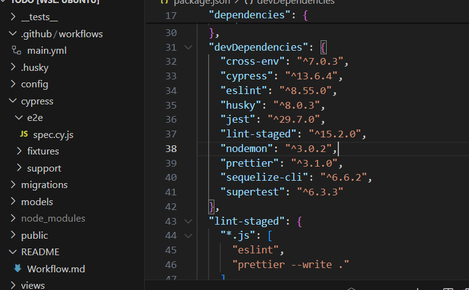
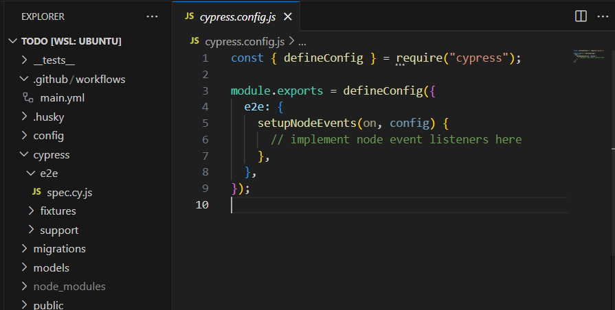
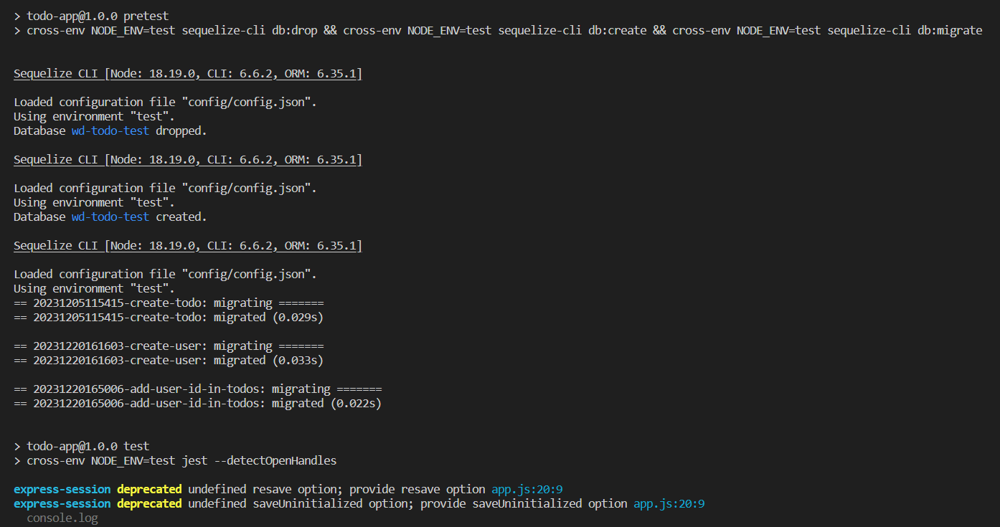
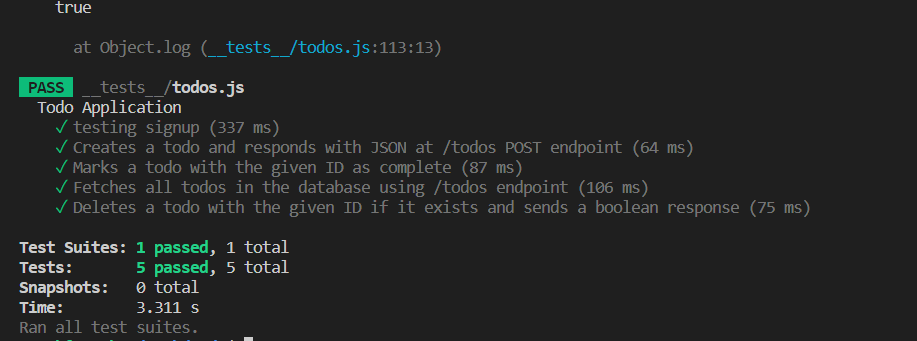
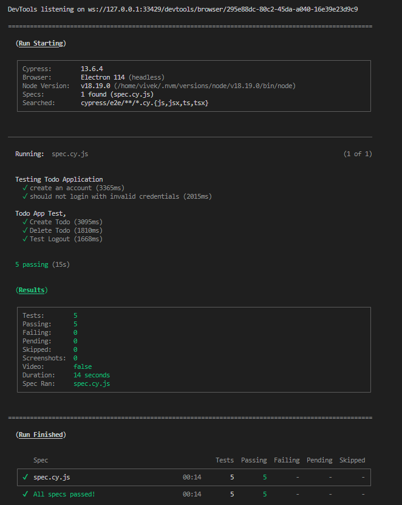

### Configuration of Testing Framework:

- using Jest as framework for testing
- configuring the package.json file inside the "scripts" section.
- Test script: "test": "cross-env NODE_ENV=test jest --detectOpenHandles".
- Sets the environment variable NODE_ENV to test.
- Executes Jest for running the tests, ensuring proper environment setup.

### Test Suite Coverage:

- Comprehensive coverage of various functionalities of the Todo application.
- Includes various unit tests and integration tests.
- Unit tests implemented using Jest, covering individual components and functions.
- Integration tests performed using Supertest to test API endpoints.
- End-to-end tests conducted using Cypress to simulate user interactions.

### Automatic Test Suite Execution on GitHub:

1. Create Workflow File: Inside your GitHub repository, create a directory named .github/workflows if it doesn't exist already. Then, create a YAML file within this directory to define your workflow. You might name it something like test.yml or ci.yml.
2. Define Workflow Steps: In the YAML file, define the steps necessary to execute your test suite. This typically involves checking out the code, installing dependencies, and running tests. Here's a basic example for a Python project using pytest:
3. Commit and Push: Commit the workflow file to your repository and push it to GitHub.
4. Enable GitHub Actions: If you haven't already done so, enable GitHub Actions for your repository by going to the "Actions" tab in your repository and following the prompts to enable workflows.
5. Monitor Execution: Once GitHub Actions is enabled, it will automatically execute the workflow defined in your YAML file whenever there's a push or pull request to the specified branches. You can monitor the execution of your test suite directly within the GitHub interface.
6. View Results: After the workflow execution completes, you can view the results, including any failing tests or errors, directly within the GitHub Actions tab or in the pull request checks.

### GitHub Actions Walkthrough:

- Starts by defining the name of the workflow and specifying the triggers.
- Sets up a PostgreSQL service container for the test database.
- Checks out the repository code and installs dependencies using npm ci.
- Sets up the test database by running Sequelize commands to drop, create, and migrate the database schema.
- Runs unit tests using Jest.
- Installs Cypress and executes integration tests to validate the functionality of the application.

### Conclusion:

- Demonstrates a robust testing setup with Jest, Supertest, and Cypress.
- Automatic test suite execution on GitHub using GitHub Actions ensures continuous testing.
- Helps maintain code quality by detecting regressions early in the development process.
- Provides a comprehensive solution for ensuring the reliability and functionality of the Todo application.

### Dev Dependencies:

```json
 "devDependencies": {
    "cross-env": "^7.0.3",
    "cypress": "^13.6.4",
    "eslint": "^8.55.0",
    "husky": "^8.0.3",
    "jest": "^29.7.0",
    "lint-staged": "^15.2.0",
    "nodemon": "^3.0.2",
    "prettier": "^3.1.0",
    "sequelize-cli": "^6.6.2",
    "supertest": "^6.3.3"
  }


```



### Cypress Configuration:

```javascript
const { defineConfig } = require("cypress");

module.exports = defineConfig({
  e2e: {
    setupNodeEvents(on, config) {
      // implement node event listeners here
    },
  },
});
```



### Jest Test suite:

```javascript
const request = require("supertest");
var cheerio = require("cheerio");
const db = require("../models/index");
const app = require("../app");

let server, agent;
function extractCsrfToken(res) {
  var $ = cheerio.load(res.text);
  return $("[name=_csrf]").val();
}

const login = async (agent, username, password) => {
  let res = await agent.get("/login");
  let csrfToken = extractCsrfToken(res);
  res = await agent.post("/session").send({
    email: username,
    password: password,
    _csrf: csrfToken,
  });
};

describe("Todo Application", function () {
  beforeAll(async () => {
    await db.sequelize.sync({ force: true });
    server = app.listen(4000, () => {});
    agent = request.agent(server);
  });

  afterAll(async () => {
    try {
      await db.sequelize.close();
      await server.close();
    } catch (error) {
      console.log(error);
    }
  });

  test("Sign up", async () => {
    let res = await agent.get("/signup");
    let csrfToken = extractCsrfToken(res);
    res = await agent.post("/users").send({
      firstName: "Test",
      lastName: "User A",
      email: "userA.a@gmail.com",
      password: "12345678",
      _csrf: csrfToken,
    });
    expect(res.statusCode).toBe(302);

    res = await agent.get("/signup");
    csrfToken = extractCsrfToken(res);
    res = await agent.post("/users").send({
      firstName: "Test B",
      lastName: "User B",
      email: "userB.b@gmail.com",
      password: "87654321",
      _csrf: csrfToken,
    });
    expect(res.statusCode).toBe(302);
  });

  test("Sign out", async () => {
    let res = await agent.get("/todos");
    expect(res.statusCode).toBe(200);
    res = await agent.get("/signout");
    expect(res.statusCode).toBe(302);
    res = await agent.get("/todos");
    expect(res.statusCode).toBe(302);
  });

  test("Creates a todo ", async () => {
    const agent = request.agent(server);
    await login(agent, "userA.a@gmail.com", "12345678");
    const res = await agent.get("/todos");
    const csrfToken = extractCsrfToken(res);
    const response = await agent.post("/todos").send({
      title: "Buy milk",
      dueDate: new Date().toISOString(),
      _csrf: csrfToken,
    });
    expect(response.statusCode).toBe(302);
  });

  test("Creates a todo  with future date", async () => {
    const agent = request.agent(server);
    await login(agent, "userA.a@gmail.com", "12345678");
    const res = await agent.get("/todos");
    const csrfToken = extractCsrfToken(res);
    const response = await agent.post("/todos").send({
      title: "Buy milk",
      dueDate: new Date(
        new Date().setDate(new Date().getDate() + 1)
      ).toISOString(),
      _csrf: csrfToken,
    });
    expect(response.statusCode).toBe(302);
  });

  test("marking an item as complete and then incomplete ", async () => {
    const agent = request.agent(server);
    await login(agent, "userA.a@gmail.com", "12345678");
    let res = await agent.get("/todos");
    let csrfToken = extractCsrfToken(res);
    await agent.post("/todos").send({
      title: "Buy Choclate",
      dueDate: new Date().toISOString(),
      _csrf: csrfToken,
    });

    let groupedTodosResponse = await agent
      .get("/todos")
      .set("Accept", "application/json");
    let parsedTodoResponse = JSON.parse(groupedTodosResponse.text);
    let dueTodayCount = parsedTodoResponse.dueTodayTodos.length;
    let latestTodo = parsedTodoResponse.dueTodayTodos[dueTodayCount - 1];
    res = await agent.get("/todos");
    csrfToken = extractCsrfToken(res);
    let completionStatusResponse = await agent
      .put(`/todos/${latestTodo.id}`)
      .send({
        _csrf: csrfToken,
        completed: latestTodo.completed,
      });
    let parsedUpdatedResponse = JSON.parse(completionStatusResponse.text);
    expect(parsedUpdatedResponse.completed).toBe(true);

    groupedTodosResponse = await agent
      .get("/todos")
      .set("Accept", "application/json");
    parsedTodoResponse = JSON.parse(groupedTodosResponse.text);
    let completedTodosCount = parsedTodoResponse.completedTodos.length;
    latestTodo = parsedTodoResponse.completedTodos[completedTodosCount - 1];
    res = await agent.get("/todos");
    csrfToken = extractCsrfToken(res);
    let inCompletionStatusResponse = await agent
      .put(`/todos/${latestTodo.id}`)
      .send({
        _csrf: csrfToken,
        completed: latestTodo.completed,
      });
    parsedUpdatedResponse = JSON.parse(inCompletionStatusResponse.text);
    expect(parsedUpdatedResponse.completed).toBe(false);
  });

  test("Deletes a todo with the given ID if it exists and sends a boolean response", async () => {
    const agent = request.agent(server);
    await login(agent, "userA.a@gmail.com", "12345678");
    let res = await agent.get("/todos");
    let csrfToken = extractCsrfToken(res);
    await agent.post("/todos").send({
      title: "Buy ps5",
      dueDate: new Date().toISOString(),
      _csrf: csrfToken,
    });
    let groupedTodosResponse = await agent
      .get("/todos")
      .set("Accept", "application/json");

    const parsedTodoResponse = JSON.parse(groupedTodosResponse.text);
    const dueTodayCount = parsedTodoResponse.dueTodayTodos.length;
    const latestTodo = parsedTodoResponse.dueTodayTodos[dueTodayCount - 1];
    res = await agent.get("/todos");
    csrfToken = extractCsrfToken(res);
    const deleteStatusResponse = await agent
      .delete(`/todos/${latestTodo.id}`)
      .send({
        _csrf: csrfToken,
      });
    const parsedDeletedResponse = JSON.parse(deleteStatusResponse.text);
    expect(parsedDeletedResponse.success).toBe(true);
  });

  test("check if userB can update userA todo's ", async () => {
    let agent = request.agent(server);
    await login(agent, "userA.a@gmail.com", "12345678");
    let res = await agent.get("/todos");
    let csrfToken = extractCsrfToken(res);
    await agent.post("/todos").send({
      title: "go to college",
      dueDate: new Date().toISOString(),
      _csrf: csrfToken,
    });
    let groupedTodosResponse = await agent
      .get("/todos")
      .set("Accept", "application/json");

    const parsedTodoResponse = JSON.parse(groupedTodosResponse.text);
    const dueTodayCount = parsedTodoResponse.dueTodayTodos.length;
    const latestTodo = parsedTodoResponse.dueTodayTodos[dueTodayCount - 1];

    res = await agent.get("/signout");
    expect(res.statusCode).toBe(302);

    agent = request.agent(server);
    await login(agent, "userB.b@gmail.com", "87654321");
    res = await agent.get("/todos");
    csrfToken = extractCsrfToken(res);
    let completionStatusResponse = await agent
      .put(`/todos/${latestTodo.id}`)
      .send({
        _csrf: csrfToken,
        completed: latestTodo.completed,
      });
    expect(completionStatusResponse.status).toBe(422);
  });

  test("check if userB can delete userA todo's ", async () => {
    let agent = request.agent(server);
    await login(agent, "userA.a@gmail.com", "12345678");
    let res = await agent.get("/todos");
    let csrfToken = extractCsrfToken(res);
    await agent.post("/todos").send({
      title: "Buy ps5",
      dueDate: new Date().toISOString(),
      _csrf: csrfToken,
    });
    let groupedTodosResponse = await agent
      .get("/todos")
      .set("Accept", "application/json");

    const parsedTodoResponse = JSON.parse(groupedTodosResponse.text);
    const dueTodayCount = parsedTodoResponse.dueTodayTodos.length;
    const latestTodo = parsedTodoResponse.dueTodayTodos[dueTodayCount - 1];

    res = await agent.get("/signout");
    expect(res.statusCode).toBe(302);

    agent = request.agent(server);
    await login(agent, "userB.b@gmail.com", "87654321");
    res = await agent.get("/todos");
    csrfToken = extractCsrfToken(res);
    const deleteStatusResponse = await agent
      .delete(`/todos/${latestTodo.id}`)
      .send({
        _csrf: csrfToken,
      });
    const parsedDeletedResponse = JSON.parse(deleteStatusResponse.text);
    expect(parsedDeletedResponse.success).toBe(false);
  });
});
```




### Cypress Test Suite:

```javascript
let baseUrl = "http://localhost:3000";

const generateRandomEmail = () => {
  const timestamp = new Date().getTime();
  return `user${timestamp}@example.com`;
};

function getCurrentDateFormatted() {
  const today = new Date();
  const year = today.getFullYear();
  const month = String(today.getMonth() + 1).padStart(2, "0");
  const day = String(today.getDate()).padStart(2, "0");

  return `${year}-${month}-${day}`;
}

const email = generateRandomEmail();

describe("Testing Todo Application", () => {
  it("create an account", () => {
    cy.visit(baseUrl + "/signup");

    cy.get('input[name="firstName"]').type("vivekvivek");
    cy.get('input[name="email"]').type(email);
    cy.get('input[name="password"]').type("vivekvivek");

    cy.get('input[name="lastName"]').type("vivekvivek");

    cy.get('button[type="submit"]').click();
    cy.wait(500);
    cy.location().should((loc) => {
      expect(loc.pathname).to.eq("/todos");
    });
  });
  it("should not login with invalid credentials", () => {
    cy.visit(baseUrl + "/login");
    cy.get('input[name="email"]').type(email);
    cy.get('input[name="password"]').type("inv@lid");
    cy.get('button[type="submit"]').click();
    cy.wait(500);
    cy.location().should((loc) => {
      expect(loc.pathname).to.eq("/login");
    });
  });
});

describe("Todo App Test,", () => {
  beforeEach(() => {
    cy.visit(baseUrl + "/login");

    cy.get('input[name="email"]').type(email);
    cy.get('input[name="password"]').type("vivekvivek");
    cy.get('button[type="submit"]').click();
  });

  it("Create Todo", () => {
    cy.get('input[name="title"]').type("Sample due later item");
    cy.get('input[name="dueDate"]').type(getCurrentDateFormatted());

    cy.get('button[type="submit"]').click();
    cy.wait(500);
    cy.get(".Todo-Item").should("exist");
    cy.get("#count-due-today").contains("1");
  });

  it("Delete Todo", () => {
    cy.contains("label", "Sample due later item")
      .next("a")
      .trigger("mouseover", { force: true })
      .click({ force: true });
    cy.get("#count-overdue").contains("0");
  });

  it("Test Logout", () => {
    cy.contains("signout", { matchCase: false }).click({ force: true });
    cy.location().should((loc) => {
      expect(loc.pathname).to.eq("/");
    });
  });
});
```



### Github Actions Walkthrough:

```yaml
name: CI/CD
# Triggers the workflow on every push event
on: push

# Environment variables

env:
  PG_DATABASE: "${{ secrets.POSTGRES_DATABASE }}"
  PG_USER: "${{ secrets.POSTGRES_USER }}"
  PG_PASSWORD: "${{ secrets.POSTGRES_PASSWORD }}"

# Jobs
jobs:
  # Job to run tests

  run-tests:
    # Runs on Ubuntu latest version

    runs-on: ubuntu-latest

    # Define a PostgreSQL service for running tests
    services:
      postgres:
        image: postgres:11.7
        env:
          POSTGRES_USER: "postgres"
          POSTGRES_PASSWORD: "ravi"
          POSTGRES_DB: "wd-todo-test"
        options: >-
          --health-cmd pg_isready
          --health-interval 10s
          --health-timeout 5s
          --health-retries 5
        ports:
          - 5432:5432

    # Steps to execute within the job
    steps:
      # Check out repository code
      - name: Check out repository code
        uses: actions/checkout@v3

        # Install dependencies
      - name: Install dependencies
        run: npm ci
      # Run unit tests
      - name: Run unit tests
        run: npm test
      # Run the app
      - name: Run the app
        id: run-app
        run: |
          npx sequelize-cli db:drop
          npx sequelize-cli db:create
          npx sequelize-cli db:migrate
          PORT=3000 npm start &
          sleep 5
      # Run integration tests
      - name: Run integration tests
        run: |
          npm install cypress cypress-json-results
          npx cypress run

  # Job to deploy the app to production
  deploy:
    # Define the job dependencies
    needs: run-tests
    runs-on: ubuntu-latest
    if: needs.run-tests.result == 'success'

    # Steps to execute within the job
    steps:
      # Deploy to production using a custom action
      - name: Deploy to production
        uses: johnbeynon/render-deploy-action@v0.0.8
        with:
          service-id: "${{ secrets.MY_RENDER_SERVICE_ID }}"
          api-key: "${{ secrets.MY_RENDER_API_KEY }}"

  # Job to send Slack notifications
  notify:
    # Define the job dependencies
    needs: [run-tests, deploy]
    runs-on: ubuntu-latest

    if: ${{ always() }}
    steps:
      - name: Send Slack notification on success

        # Send a Slack notification if the tests and deployment are successful
        if: ${{ needs.run-tests.result == 'success' && needs.deploy.result == 'success' }}
        uses: slackapi/slack-github-action@v1.25.0
        with:
          payload: |
            {
              "text": "CI/CD process succeeded!" 
            }
        env:
          SLACK_WEBHOOK_URL: ${{ secrets.SLACK_WEBHOOK_URL }}

      - name: Send Slack notification on failure
        if: ${{ needs.run-tests.result != 'success' || needs.deploy.result != 'success' }}
        uses: slackapi/slack-github-action@v1.25.0
        with:
          payload: |
            {
              "text": "*${{ github.workflow }}* failed. Access the details https://github.com/${{ github.repository }}/actions/runs/${{ github.run_id }}."
               
            }
        env:
          SLACK_WEBHOOK_URL: ${{ secrets.SLACK_WEBHOOK_URL }}
```


