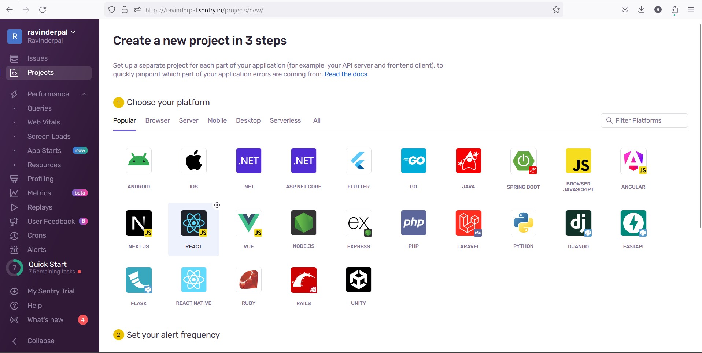
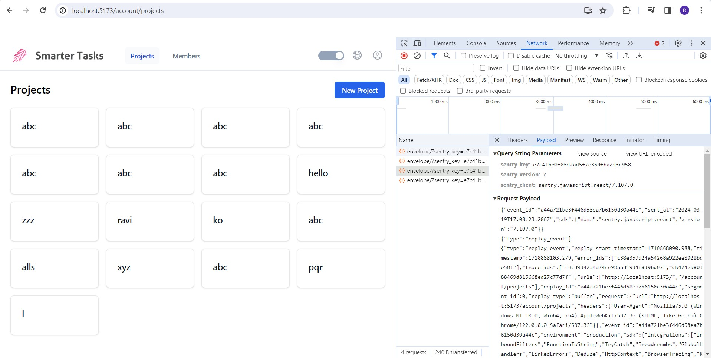
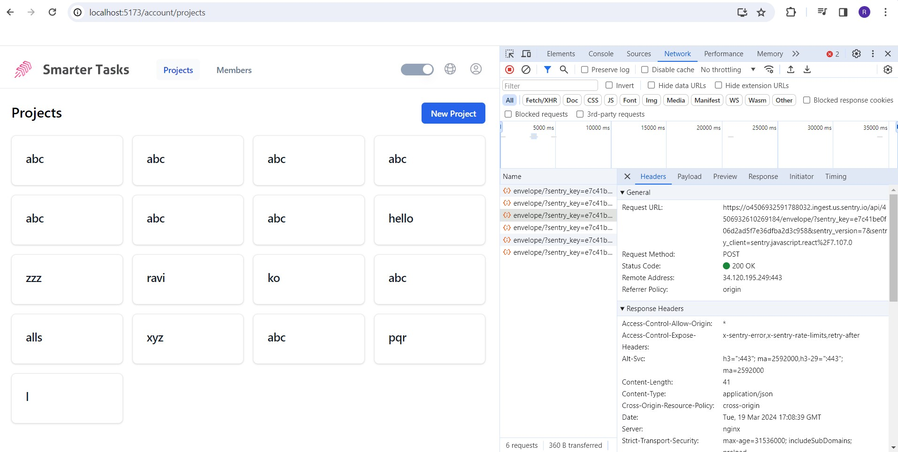
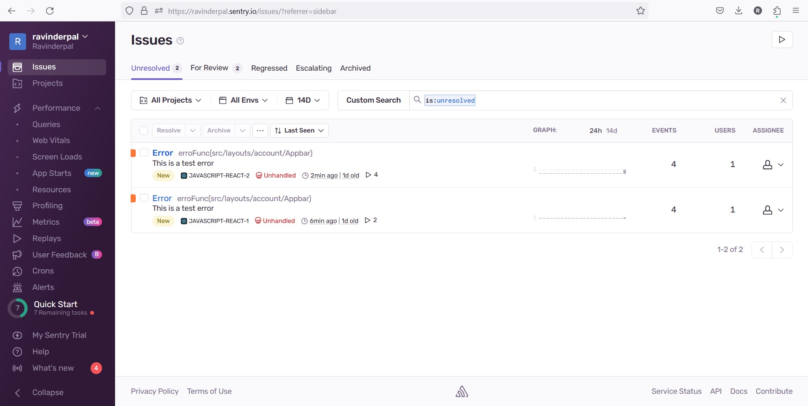
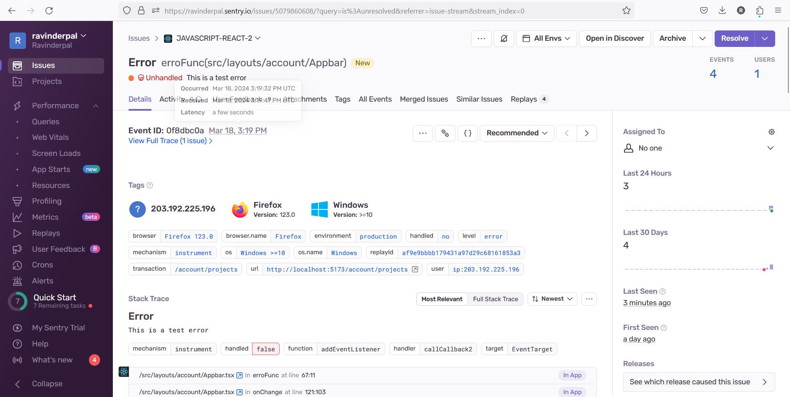
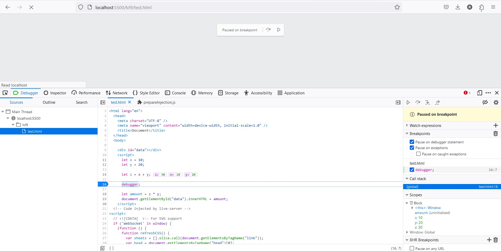

# Integration of Sentry:
  
  Sentry was selected as the error tracking system for its comprehensive features and ease of integration with React.js applications.
  The Sentry SDK for JavaScript, specifically designed for React applications, was installed and configured within the project.
  Integration was achieved by following the official documentation and utilizing npm or yarn to install necessary packages.
  Sentry was initialized in the application's entry file, ensuring that it captures errors occurring throughout the application.

# Install Sentry SDK
  Sentry CLI is a command-line tool that helps you manage your Sentry projects
   ```bash
   npm install --save @sentry/react
   ```

# Initialize Sentry
   ```jsx
   import * as Sentry from "@sentry/react";
    Sentry.init({
      dsn: "https://e7c41be0f06d2ad5f7e36dfba2d3c958@o4506932591788032.ingest.us.sentry.io/4506932610269184",
      integrations: [
        Sentry.browserTracingIntegration(),
        Sentry.replayIntegration({
          maskAllText: false,
          blockAllMedia: false,
        }),
      ],
      // Performance Monitoring
      tracesSampleRate: 1.0, //  Capture 100% of the transactions
      // Set 'tracePropagationTargets' to control for which URLs distributed tracing should be enabled
      tracePropagationTargets: ["localhost", /^https:\/\/yourserver\.io\/api/],
      // Session Replay
      replaysSessionSampleRate: 0.1, // This sets the sample rate at 10%. You may want to change it to 100% while in development and then sample at a lower rate in production.
      replaysOnErrorSampleRate: 1.0, // If you're not already sampling the entire session, change the sample rate to 100% when sampling sessions where errors occur.
    });
   ```
Images
- 

# Upload Source Maps
- To ensure readable stack traces in Sentry, upload source maps either manually or automatically using Sentry Wizard:
- `npx @sentry/wizard@latest -i sourcemaps`

logs:
```bash
Need to install the following packages:
@sentry/wizard@3.21.0
Ok to proceed? (y) y
(node:4934) [DEP0040] DeprecationWarning: The `punycode` module is deprecated. Please use a userland alternative instead.
(Use `node --trace-deprecation ...` to show where the warning was created)
Running Sentry Wizard...
version: 3.21.0 | sentry-cli version: 1.77.3
Sentry Wizard will help you to configure your project
Thank you for using Sentry :)
Skipping connection to Sentry due files already patched

┌   Sentry Source Maps Upload Configuration Wizard 
│
◇   ──────────────────────────────────────────────────────────────────────────────────╮
│                                                                                     │
│  This wizard will help you upload source maps to Sentry as part of your build.      │
│  Thank you for using Sentry :)                                                      │
│                                                                                     │
│  (This setup wizard sends telemetry data and crash reports to Sentry.               │
│  You can turn this off by running the wizard with the '--disable-telemetry' flag.)  │
│                                                                                     │
│  Version: 3.21.0                                                                    │
│                                                                                     │
├─────────────────────────────────────────────────────────────────────────────────────╯
│
▲  You have uncommitted or untracked files in your repo:
│  
│  - dev-dist/sw.js
│  - index.html
│  - package-lock.json
│  - package.json
│  - src/App.tsx
│  - src/components/LiveMatches/LiveMatches.tsx
│  - src/components/SportArticles/SportArticleCard.tsx
│  - src/components/SportArticles/SportsArticleModal.tsx
│  - src/components/SportArticles/index.tsx
│  - src/main.tsx
│  - src/pages/Home.tsx
│  - src/i18n.ts
│  - src/locales/
│  
│  The wizard will create and update files.
│
◇  Do you want to continue anyway?
│  Yes
│
◇  Are you using Sentry SaaS or self-hosted Sentry?
│  Sentry SaaS (sentry.io)
│
◇  Do you already have a Sentry account?
│  Yes
│
●  If the browser window didn't open automatically, please open the following link to log into Sentry:
│  
│  https://sentry.io/account/settings/wizard/h1tjmh0j0f1geq27mqjsoh4v9h0trus3rwb6nmo0xtgij2e5yezkb0sd7k0s6qik/
│
◇  Login complete.
│
◇  Select your Sentry project.
│  iare-ca19832e9/sportify
│
◇  Which framework, bundler or build tool are you using?
│  Vite
│
◇  Installed @sentry/vite-plugin with NPM.
│
◆  Added the Sentry Vite plugin to vite.config.ts and enabled source maps
│
●  We recommend checking the modified file after the wizard finished to ensure it works with your build setup.
│
◆  Created .env.sentry-build-plugin with auth token for you to test source map uploading locally.
│
◆  Added .env.sentry-build-plugin to .gitignore.
│
◇  Are you using a CI/CD tool to build and deploy your application?
│  No
│
●  No Problem! Just make sure that the Sentry auth token from .env.sentry-build-plugin is available whenever you build and deploy your app.
│
└  That's it - everything is set up!

   Test and validate your setup locally with the following Steps:

   1. Build your application in production mode.
      → For example, run npm run build.
      → You should see source map upload logs in your console.
   2. Run your application and throw a test error.
      → The error should appear in Sentry:
      → https://iare-ca19832e9.sentry.io/issues/?project=4506915022045184
   3. Open the error in Sentry and verify that it's source-mapped.
      → The stack trace should show your original source code.
   
   If you encounter any issues, please refer to the Troubleshooting Guide:
   https://docs.sentry.io/platforms/javascript/sourcemaps/troubleshooting_js

   If the guide doesn't help or you encounter a bug, please let us know:
   https://github.com/getsentry/sentry-javascript/issues

```

## Error Function

- ```jsx
  const erroFunc = () => {
    throw new Error("This is a test error");
  }
  <Switch
      checked={enabled}
      aria-label="toggleTheme"
      onChange={() => erroFunc()}
    >
  </Switch>
  ```
The above code shows the error function and the switch buttton wich on toggles throws an error wich is reflected in the sentry post request goes to sentry with information encrypted
- 
- 

## Error Debuggin using Sentry
Debugging errors using Sentry involves leveraging its error monitoring capabilities along with additional debugging tools to identify and resolve issues efficiently
We can find the Error related details in sentry portal
- Log in to your Sentry dashboard and navigate to the project where errors are being tracked.
- Review the list of captured errors to identify the ones you need to debug.
- Click on an error to view detailed information, including stack traces, error messages, and contextual data.
- Examine the stack trace to understand the sequence of function calls leading to the error.
- Read the error message to gain insights into the nature of the error.
- Review any contextual data provided by Sentry, such as user actions or environment information, to understand the context in which the error occurred.
- 
- 


### Debugger by JS

```html
<html lang="en">
  <head>
    <meta charset="UTF-8" />
    <meta name="viewport" content="width=device-width, initial-scale=1.0" />
    <title>Document</title>
  </head>
  <body>
    Simple Interest
    <div id="si"></div>
    <script>
      let p = 30000;
      let n = 6;
      let r = 8

      debugger;

      let si = p*n*r/100;
      document.getElementById("si").innerHTML = si;
    </script>
  </body>
</html>
```

- 

- Opening Developer Tools: When you load the HTML file in a browser, the JavaScript code inside the <script> tag is executed. When the JavaScript engine encounters the debugger; statement, it pauses the execution of the code.

- Pausing Execution: The presence of debugger; statement triggers the browser's JavaScript debugger. This action halts the execution of the code at that specific line.

- Inspecting Variables: At this point, you can inspect the values of variables (p, n, r, si, etc.) and their current state. This allows you to verify whether the variables contain the expected values and identify any discrepancies.

- Stepping Through Code: You have various options to proceed from this paused state:
  Step Into: Proceed to the next line of code.
  Step Over: Execute the current line of code and proceed to the next line.
  Step Out: Exit the current function and proceed to the calling function.
  Resume Execution: Continue executing the code until another breakpoint or the end of the script is encountered.

- Observing Changes: As you step through the code, you can observe how variables change and whether the calculations are performed correctly.

- Fixing Issues: If you identify any issues (e.g., incorrect variable values, calculation errors), you can make changes to the code and continue debugging until the code behaves as expected.

- Removing Debugging Statements: Once you've identified and fixed the issues in your code, you can remove or comment out the debugger; statement. This ensures that the code executes without interruption in production or in scenarios where debugging is not needed.

Debugging is an essential skill for developers, as it allows them to diagnose and resolve issues efficiently, ensuring that their code works as intended. It's a valuable tool for improving the quality and reliability of software applications.

## Conclusion
In summary, the combination of a robust error tracking system and debugger capabilities provides developers with the necessary tools and processes to detect, diagnose, and resolve issues at every stage of the application lifecycle. By prioritizing error prevention, proactive monitoring, and efficient debugging practices, teams can deliver high-quality applications that meet performance, reliability, and user experience expectations.